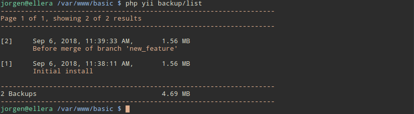
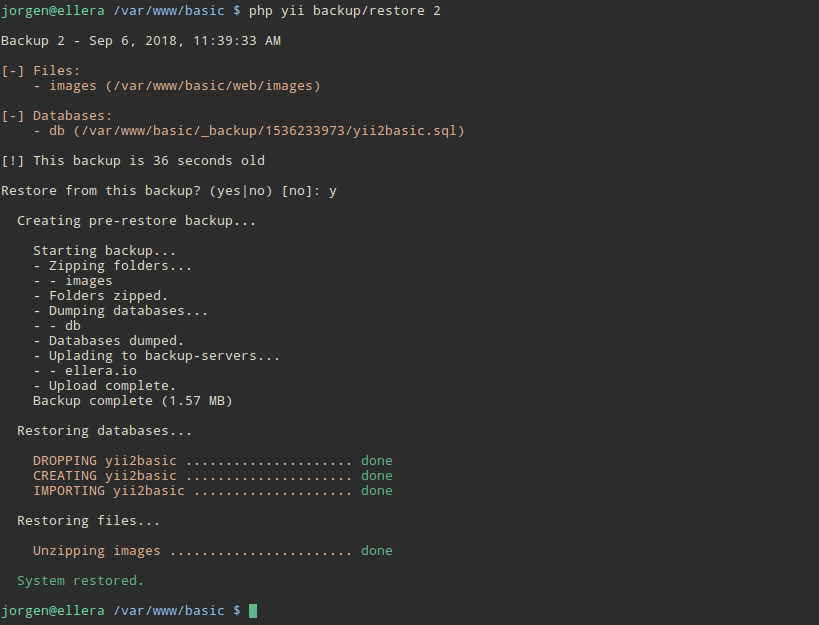
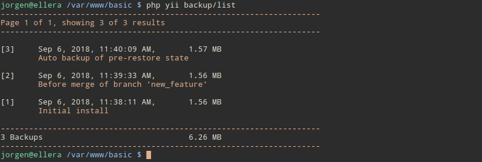

# Yii2-Backup
Console backup for yii2 applications. 

Current limitations:
- Currently only MySQL on localhost is supported
- Requires a linux system

## Getting started

Installation
------------

The preferred way to install this extension is through [composer](http://getcomposer.org/download/).

Either run

```
php composer.phar require ellera/yii2-backup
```

or add

```
"ellera/yii2-backup": "*"
```

to the require section of your `composer.json` file.

Basic Usage
-----------
Add the following to your config file. For yii2 advanced template, this should be placed in `console/config/main.php`, for basic it should be in `config/console.php`.
You can use another name then `backup` but you'll need to adjust the commands accordingly. 

```php
'modules' => [
    ...
    'backup' => [
        'class' => 'ellera\backup\Module'
    ]
    ...
]
```

Then migrate database migrations. This will create a table named `backup` in your database. 

```
php yii migrate/up --migrationPath=@vendor/ellera/yii2-backup/src/migrations
```

When the migration is done, you're ready to backup your site. Use `php yii *command*` or `./yii *command*` with the commands from the following table:

| Command | Description | 
| --- | --- |
| backup | List all the available commands | 
| backup/create "Optional comment" | Crate a manual backup |
| backup/create/cron "Optional comment" | Use this command for cron jobs |
| backup/list #OptionalPage | Lists the current backups | 
| backup/delete #ID | Deletes a backup | 
| backup/restore #ID | Restores a backup | 

##### Manual: Create backup
`php yii backup/create "Your Comment"`


##### Cron: Create backup
`php yii backup/create/cron "Cron Job - Daily backup"`

##### Manual: List backups
`php yii backup/list (# optional page number)`



##### Manual: Restore backup
`php yii backup/restore #`



This will create an additional backup of the state before the restore



##### Manual: Delete backup
`php yii backup/delete #`


Advanced  Usage
---------------
##### Backing up files and folders
You can backup as many locations as you'd like by adding them to the folders array. To create backups require read access to the folder and files, to restore requires write/delete access.
The folders will be zipped and saved in the backup folder.

```php
'modules' => [
    ...
    'backup' => [
        'class' => 'ellera\backup\Module',
        'folders' => [
            'images' => '@app/web/images'
        ],
    ]
    ...
]
```

##### Changing or adding database handlers
You can backup as many databases as you'd like, but they have to be defined in your config as `yii\db\Connection`s. Add the connection name to the array (defautls to only `db`).

```php
'modules' => [
    ...
    'backup' => [
        'class' => 'ellera\backup\Module',
        'databases' => [
            'db', 
            'db2'
        ],
    ]
    ...
]
```

##### Database Conflict
If you already have a table named `backup`, create a table with your own migration and add `'table' => 'new_table_name'` to the configuration.
The content of the table can be found in the [migration](src/migrations/m180828_154717_backup.php).

```php
'modules' => [
    ...
    'backup' => [
        'class' => 'ellera\backup\Module',
        'table' => 'your_new_table_name'
    ]
    ...
]
```

##### Change the default backup location
If you want to store the backups in another directory, add `'path' => 'new/path'` to the config.

This variable is parsed trough `Yii::getAlias()` and defaults to `@app/_backup`.

```php
'modules' => [
    ...
    'backup' => [
        'class' => 'ellera\backup\Module',
        'path' => '@app/_backup'
    ]
    ...
]
```

##### Upload to remote server
If you want redundant backup over several servers, this module supports `scp` over SSH.
For this function to work, you need to have SSH keys in place and the user must have write access to the remote folder specified in the config.
It's **highly** recommended to create a user on the remote server for this purpose - do not use root.

```php
'modules' => [
    ...
    'backup' => [
        'class' => 'ellera\backup\Module',
        'servers' => [
            // Unique name
            'server_name' => [
                // Server IP or domain
                'host' => '192.186.0.1',
                // Server username
                'user' => 'remote_user',
                // Remote backup path
                'path' => '/var/backups/myserver'
            ]
        ]
    ]
    ...
]
```

##### Create a cron job
If you want to automate the backup you can use the create/cron method `php yii backup/create/cron "Cron-Job - Daily Backup"`.
This method is less verbose and will only echo out one line for logging to file.

An example cron job could look like this:
```
0 0 * * * php /path/to/yii/folder/yii backup/create/cron "Nightly automated backup" >> /var/logs/backup.log 2>&1
```

##### Automated Cleanup
If you want the system to automatically clear out old backups, you can configure `automated_cleanup`.

`automated_cleanup` defaults to false, and require an array of boolean values to be activated.
```php
    'modules' => [
    'backup' => [
        'class' => 'ellera\backup\Module',
        'automated_cleanup' => [
            'daily' => true,
            'weekly' => true,
            'monthly' => true,
            'yearly' => true
        ]
    ]
],
```
When activated the cron method will delete all but the latest backup of the period before the previous period.

Lets look at an example:
If you run hourly backups, but have configured `'daily' => true`, the first cron job of a new day will delete all but the latest backup from the period before the previous day.

##### Extendable methods
If you need to alter the system state before and after backups and restores, you can do that by extending the Methods class.
This could be useful to end all database connections or put the system into maintenance mode.

Crate a new file in your project. For instance `console\components\BackupMethods`:
```php
<?php

namespace console\components;


class BackupMethods extends \ellera\backup\components\Methods
{
	public function beforeCreate() : bool
	{
		return true;
	}

	public function afterCreate() : bool
	{
		return true;
	}

	public function beforeRestore() : bool
	{
		return true;
	}

	public function afterRestore() : bool
	{
		return true;
	}
}
```

And update the config to use this file:
```php
'modules' => [
	'backup' => [
		'class' => 'ellera\backup\Module',
		'methods_class' => 'console\components\BackupMethods'
	]
],
```

This methods will be invoked before and after create and restore, and if the before methods return false the execution will be stopped.

If the after methods returns false they will echo a warning to the terminal/log.